# Overview

This document describes how to build a Buggy Bar. The Buggy Bar is a kite control bar designed by and for kite buggiers. This bar is targeted specifically at non-jumping land-kiting with a focus on high function and ease of use to keep the flier safe and focused on piloting. This design is released under a Creative Commons license to allow anyone to use the design to build the bar for personal use or resale.

{#fig-finished-bar fig-alt="Finished Bar" fig-align="center" width="650"}

This release replaces the mini-chickenloop with [KQR](https://orangekiter.jimdofree.com/kieler-quickrelease/) rings and the flag line end with a loop and ring to retain it within the KQR rings. The KQR components are shown in @fig-kqr-rings and @fig-kqr-body.

{#fig-kqr-rings fig-alt="KQR rings and ring holder installed in a bar" fig-align="center" width="650"}

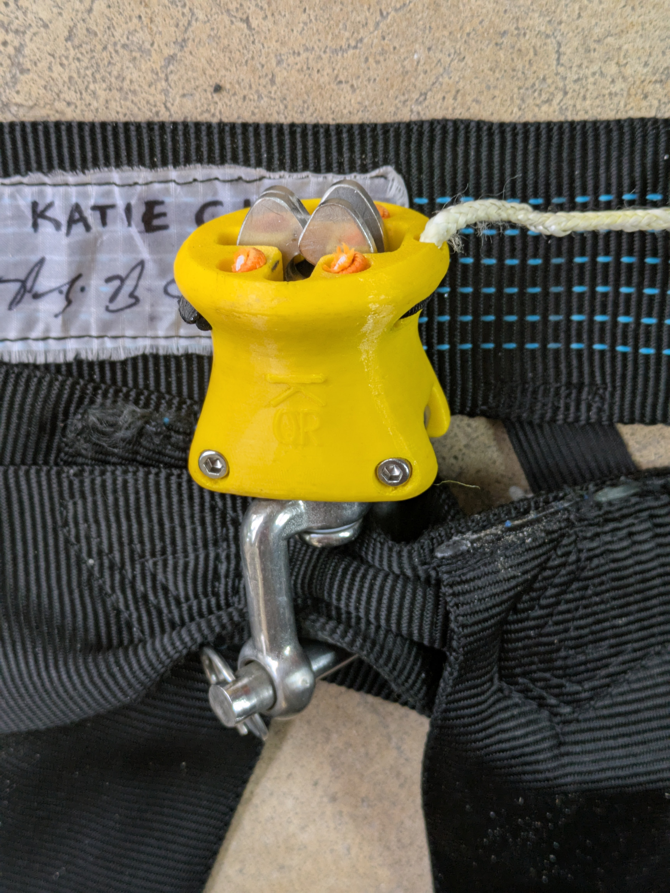{#fig-kqr-body fig-alt="KQR body installed in a harness" fig-align="center" width="650"}

## Bill of materials

-   1 kite control bar: 17" - 20" between the steering lines; a rimless, circular trimline borehole on the kite-side of the bar; a deeply beveled cut left and right of the trimline borehole on the pilot-side of the bar.
-   1 CL826-11AN AERO CLEAT FOR 4-6MM ROPES - HARD ANODISED
-   2110mm Samson AmSteel-Blue Single Braid Line Diameter: 5/32" (4mm)
-   1250mm of 500# - 600# Dyneema (precise specs do not matter)
-   4910mm hollow core braided 1.6mm Dyneema with a *very* loose braid (I use <https://www.amazon.com/dp/B06XTL3K7Z?th=1> from emma kites)
-   1 Small Stopper Ball Green \~5/32" ID, 16-18mm OD
-   1 Medium Stopper Ball Green \~1/4" ID, 25-32mm OD
-   1 [Separation block v3 8mm trimline bore release 1.7.1](https://github.com/pbchase/kite_bar_parts/blob/master/printable/separation_block_v3_8mm_trimline_bore_2026-05-05.stl)
-   1 [Cleat Bead release 1.7.0](https://github.com/pbchase/kite_bar_parts/blob/master/printable/cleat_bead_2026-04-28.stl)
-   \~260mm of 2mm bungee
-   The bar-side rings and ring holder from a [KQR](https://orangekiter.jimdofree.com/kieler-quickrelease/). The KQR uses a 4mm x 25mm (ID) ring and a 3mm x 20mm (ID) ring attached to the trim line with a larks head. A third ring, 3mm x 15mm (ID), is attached with a larks head to the end of the flag line. Optionally use an [IQR](https://www.infexion.eu/seatbelt-quick-release/) instead of the KQR.

## Tools required

-   Razor blade or other very sharp knife
-   Cutting board
-   Scissors
-   Short wire fid (\~150mm)
-   Long wire fid (\~850mm)
-   Cyanoacrylate glue (preferably thin)
-   Cyanoacrylate accelerant (optional)
-   Metric tape measure
-   Sewing machine with a large needle and high-strength polyester thread, preferably V-46 Dabond 2000 UVR Polyester thread
-   A modified presser foot with a 1mm-wide groove aligned with the needle. (useful, but not required)
-   Rubber mallet
-   Bench vise with wooden jaws or other means of bending 0.025 metal sheet
-   Two strong spring clips
-   2m long stick and some scrap line to place the flag line under tension
-   Adjustable wrench for line stretching
-   5/32" drill bit
-   1/16" drill bit

# Component construction

## Control bar

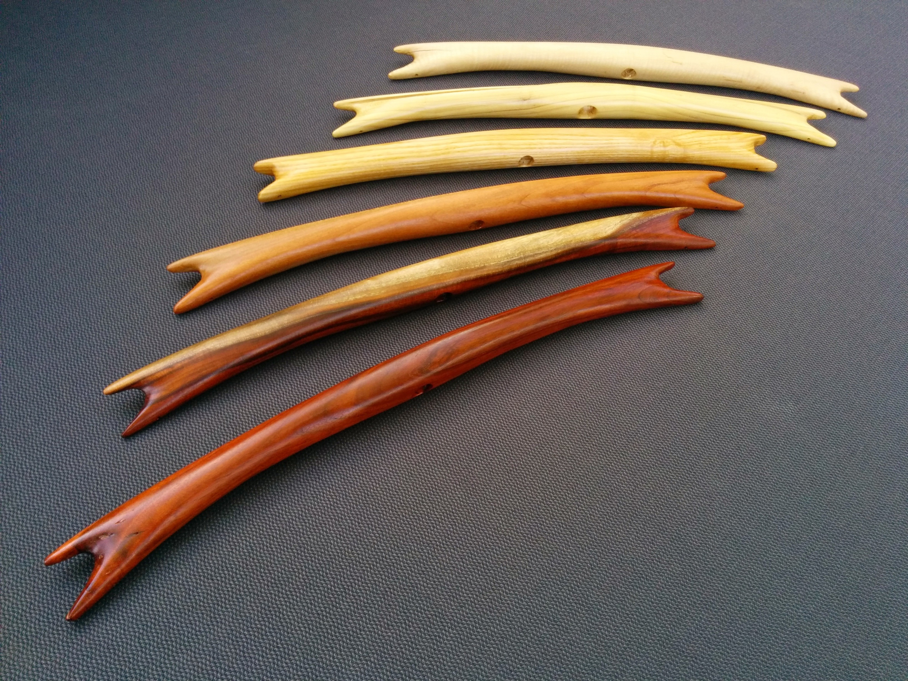{#fig-bare-bars fig-alt="Bare kite bars" fig-align="center"}

No specific control bar is required, but there are a few features the bar needs to function properly. The bar should not be any larger than needed. A bar with a 17" center-to-center spacing between the steering lines works for most suitable buggy kites. A 20" spacing is probably the largest you would ever need. The trimline bore needs to be circular and smooth on the kite face of the bar as shown in @fig-kite-side-borehole. A bore hole diameter of 1/2" (12.5mm) is about ideal. The circular hole allows the bar to spin freely against the spherical surface of the cleat bead. The smooth surface around the trimline borehole is more comfortable for gripping the bar at the center to fly with one handed.

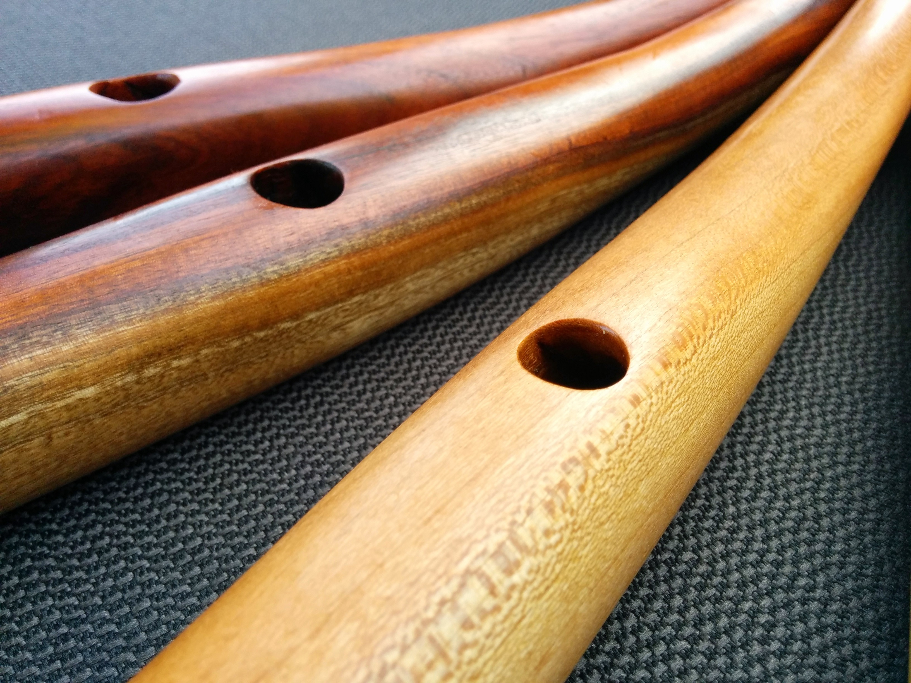{#fig-kite-side-borehole fig-alt="Kite-side of the bar showing the smooth, round bore holes" fig-align="center" width="650"}

The pilot-side of the bore hole needs to be deeply beveled left and right of the trimline borehole as shown in @fig-pilot-side-borehole. This allows the bar to be sheeted in and out during hard turns. Without the cutouts, the bar could bind in a turn and sheeting changes would be difficult if not impossible.

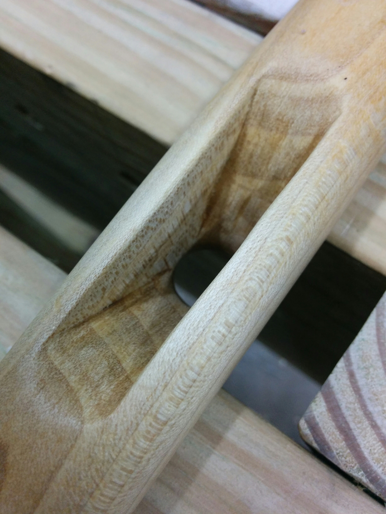{#fig-pilot-side-borehole fig-alt="Pilot-side of a bare bar showing the left and right cuts around the bore" fig-align="center" width="650"}

## Trim Line

To build the trim line, you will need 2110mm of Amsteel Blue (use only the gray color), 80mm x 105mm of insignia cloth (dark colors are better), two 18mm x 3mm nickel-plated neodymium disc magnets, 150mm of 0.095" plastic cord, one small stopper ball and one medium stopper ball.

### Prepping the trim line

Cut a segment of gray 4mm Amsteel Blue to a length of 2110mm with a fresh razor blade to get a clean cut. Thin each end of the line in preparation for the end fittings. This is easy by pinning the tip to a cutting board with a sharp razor blade and pulling the tip through the blade. Do this three times on each end at 5mm, 15mm and 25mm distance from the end.

### Upper end of the trim line

The upper end of the trim line is designed to be easily gripped for trim control, firm-gripping in the cleat, and easily tethered when not being handled. The firm grip is ensured by adding an inner core of Dyneema to the upper half of the trim line. The tethering is done via a pair of magnets attached to the trim line with a wrap of insignia cloth. The insignia cloth is reinforced with a shaped piece of plastic cord. A pair of stopper balls provide a stop at the cleat and a handle just above the magnets. The completed end is visible in @fig-finished-end-of-trimline.

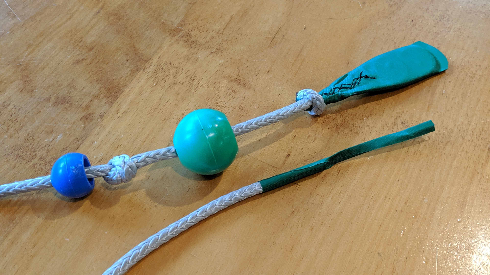{#fig-finished-end-of-trimline fig-alt="Grip end of the trim line with balls offset to show knots (above) and thread end (below)" fig-align="center" width="650"}

### Adding the trim line core

To add the trim line core, mark the trim line at 100mm[^index-1] and 1350mm from one end. Cut 1250mm of 500# Dyneema. Run the long wire inside the trim line from the one mark to the other. Clip a clothes pin to one end of the Dyneema core and pull the other end through the trim line. Milk the trim line tight onto the new core ensuring each end of the core buries inside the trim line near the marks.

[^index-1]: Consider shifting or extending the core towards the magnetic end to capture it in the stitching at that end.

### Forming the magnetic trim line tail

Form the wrap for the magnets by cutting a strip of sailmaker's insignia cloth according to the dimensions shown in @fig-magnetic-trimline-tails-9 to wrap the magnets.

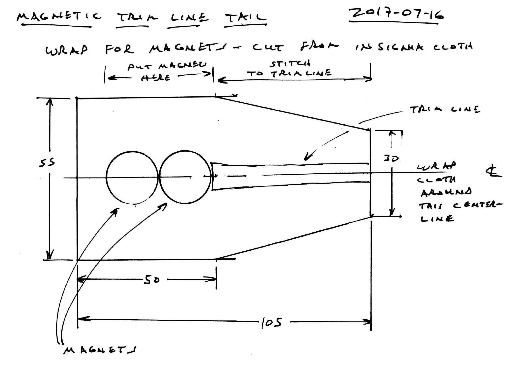{#fig-magnetic-trimline-tails-9 fig-alt="Insignia cloth patch to hold trimline magnets" fig-align="center" width="650"}

To make the reinforcement for the wrap, cut a segment of round, 0.095" diameter plastic weed-whacker cord 150mm long to wrap around the magnets and up the trim line. Bend the plastic cord until the ends meet, then clamp the ends together with a spring clip. Heat the middle of the plastic cord with a low flame. Dance the cord through the flame flipping and turning as you go to assure even heating. When the bend relaxes, form it around a 16mm x 36mm mandrel of CPVC pipe. With the plastic pulled tight against the mandrel, cool the plastic in tap water. This will lock the new shape in place.

The mandrel can be made from 5/8" diameter CPVC piping, a few strips cut from a plastic bucket to form a spacer and two screws to hold the parts together. The assembled mandrel is shown in @fig-plastic-cord-mandrel and @fig-plastic-cord-mandrel-end-view.

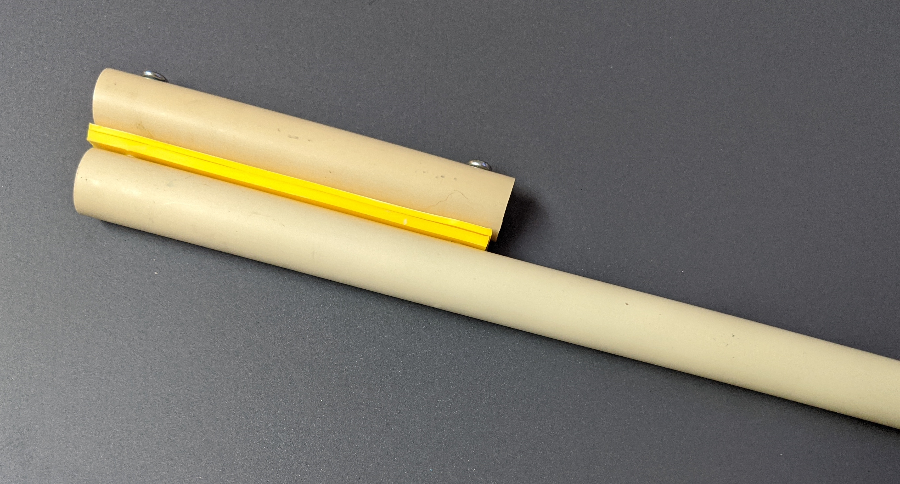{#fig-plastic-cord-mandrel fig-alt="Mandrel for forming the plastic cord that surrounds the magnets" fig-align="center" width="650"}

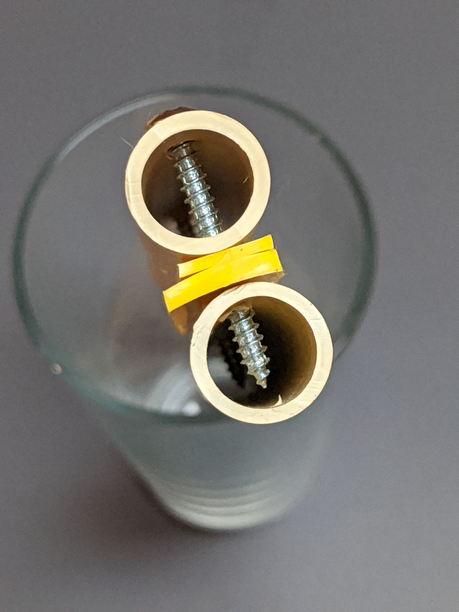{#fig-plastic-cord-mandrel-end-view fig-alt="End view of the mandrel" fig-align="center" width="650"}

Taper the last 15mm of the tips of the plastic cord so it can fit more closely against the trim line.

Thread a small stopper ball and then a medium stopper ball on to the trim line and slide them a meter up the line to get them out of the way. We'll return to these after the magnets are installed.

To assemble the loose end of the trim line, place 55mm of the unfinished end of the Amsteel on the tapered end of the magnet wrap. In your hand, place two 18mm x 3mm disc magnets edge-to-edge and align the polarity. Carefully place the pair of magnets edge-to-edge at the tip of the Amsteel aligning the long axis of the magnets with the axis of the Amsteel. It can be helpful to peel the backing of the insignia cloth incrementally, exposing only the glue needed to install the next component.

Place the curve of the plastic cord closely around the magnets. The tapered ends of the plastic cord should fit closely around the trim line.

Fold the cloth around magnets and trim line folding one side completely and then the other. The folds should be parallel to the trim line axis. The cloth must lay flat over the magnets. Because the trim line is narrower than the magnets, a crease will form where the magnets meet the trim line. This crease must not be *on* the magnets. Make sure the crease is *above* the magnets. Pinch the cloth closed below the magnets and round the end of the pinched-off fabric.

Stitch the magnet-wrap to the Amsteel so the cloth won't creep in use. Use a long straight stitch and dark thread to secure the wrap. The attractive force of the magnets is so high, it can make the trim difficult to work in a sewing machine. To reduce this effect, cut two small rectangles of cardboard from a cereal box and place them under the magnets. The increased distance between the magnets and the steel deck of the sewing machine should make the forces manageable. Be careful to not hit the magnets or the plastic cord with the sewing needle lest bad things happen.

### Knots and Balls

Tie an overhand knot at the point where the magnet wrap meets the Amsteel. The knot should be just barely above the plastic cord buried inside the magnet wrap. Push the medium stopper ball you threaded onto the stopper line a few steps earlier down on this knot. If the ball does not jam tight on the knot, retie the knot as a figure-eight to make it fatter and improve the fit against the inside of the ball.

Mark the trim line 65mm above the top of the medium ball. Tie an overhand knot in the trim line just above that mark. Push the *small* stopper ball down on this knot. Again, if the ball is not tight on the knot, retie it as a figure-eight knot to adjust the fit. The finished product can be seen in @fig-finished-end-of-trimline.

### Trim line loop

The lower end of the trim line is finished with a large loop formed with a brummel splice. The loop is designed receive the pair of rings used by the [KQR](https://orangekiter.jimdofree.com/kieler-quickrelease/). The loop needs to be about 150mm in diameter. Given the line diameter, the buried segment needs to be 250mm. To form this, mark the lower end of the trim line at 250mm, 400mm, and 720mm from the tip of the lower end of the trim line. Pierce the line at the 250mm mark, and push a loop of the upper portion of the line through the pierced hole. After pulling it through, clip a clothes pin or tie a line to the loop to assure it does not revert. Run the long fid from the 720mm mark to the 400mm mark. Put the tail through the fid at 400mm and pull the tail out at 720mm. Dress the splice.

## Cleat Jacket

The Aero Cleat requires a jacket of ferromagnetic stainless steel sheet to create a tether point for the trim line tail. Make a template from the image in @fig-cleat-jacket-template or reference the [original design](https://github.com/pbchase/kite_bar_parts/blob/master/cleat_jacket_template.svg). Trace the pattern onto a sheet of 0.025" thick 430 stainless steel sheet. Only use 430 stainless steel for the cleat jacket; other grades of stainless steel will not attract the magnets in the trim line. Cut the shape from the metal sheet, drill out the two holes with a 5/32" bit and ease all the edges with a metal file. Most of the edges will be on grippable surfaces, so do a good job of easing them.

Disassemble the cleat and reassemble it with metal sheet between the two sections of the cleat. Bend the metal sheet around the metal portion of the Aero Cleat. To do this, clamp one side of the jacket in a vise. Use a block of wood and a mallet to fold the other side against metal side of the cleat. Flip the cleat over to expose the unfolded wing of the jacket and clamp the cleat in the vise. Again, use the block of wood and a mallet to fold the remaining wing. Remove the cleat from the vise, lay it flat on a table top and use the block and mallet to crease the folds.

If you don't have a bench vise or a mallet, you can fold the wings with a pair of boards and pair of boots. Place the re-assembled cleat on a board on the ground, with the metal cleat side up. Step carefully on the metal part of the cleat to fold the lower wing of the jacket against the metal of the cleat. Flip the cleat over to place the remaining wing against the wood. Again, step on the cleat to fold the wing against the metal of the cleat. Put a second board on top of the cleat and stomp it a few times to finish the crease of the jacket.

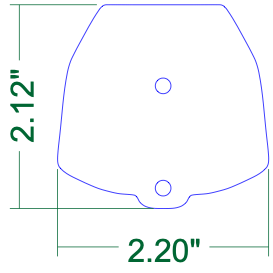{#fig-cleat-jacket-template fig-alt="Template for making an Aero Cleat Jacket" fig-align="center" width="650"}

### Dress the cleat jacket edges

Following the above instructions, the edges of the cleat jacket are never tight against the cleat. If you can cut a low block of wood the exact width of the cleat, you can fix this by adding an extra bend in the jacket. Follow these steps if you are able.

Form a shaping block by cutting a strip of wood a little bit longer than the cleat, exactly its width, but only 1/2 its height. Bevel one end to follow the descending shape at the top of the cleat. The wood mandrel should be half the cleat height along the length of the cleat.

Remove the jacket from the Aero Cleat. Slide the wood inside the jacket aligning the low end of the jacket with the low end of the block. Clamp the assembly in a vise with the jacket upright and the top of the block level with the top of the vise jaws. Use a mallet to slightly bend each side of the jacket at the mid-line. Bend jacket until the top is narrower than the cleat, but not by much. Remove the block from the jacket and reassemble the jacket and cleat. The edges of the jackets should be tight against the cleat now.

## Separation block

The juncture of the flying lines and the trim line is managed by the *separation block* as shown in @fig-separation-block

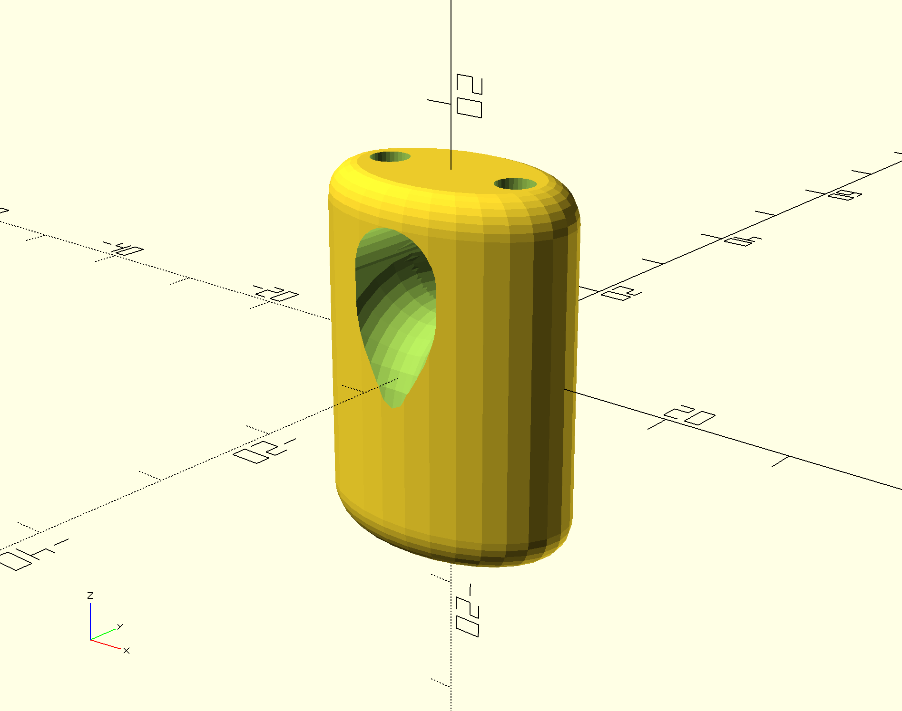{#fig-separation-block fig-alt="Separation block" fig-align="center" width="650"}

This component provides a curved path to serve as a pulley for the trim line and a guide path for each of the main flying lines. The [3-D model](https://github.com/pbchase/kite_bar_parts/blob/master/printable/separation_block_v3_8mm_trimline_bore_2026-05-05.stl) for this component is accessible in the [Kite Bar Parts](https://github.com/pbchase/kite_bar_parts) repository. Should you print this model, use a 1/8" drill to clean out the flying-line bore holes before installation. Use a sharp blade to deburr the sharp edges of the pulley hole and the flying line holes. These adjustments simplify assembly.

## Flag line

The *flag line* allows the kite to be flagged out via one of the top lines. It bridges the distance from the flying line at the underside of the separation block to the underside of the kite bar. The line is about 1400mm of hollow core braided 1.6mm Dyneema that encloses about 400mm of 2mm bungee. A short loop is incorporated into each end. This design allows the flag line to stay taught whether the bar is trimmed in or out. The Dyneema jacket can handle the loads experienced during release to assure a clean flag-out without damage to the flag line. The dimensions for the flag line are tightly constrained by the need to maintain line tension throughout the trim range. They can be calculated using a copy of the Google Sheet [kite bar elastic flag line length calculations](http://tinyurl.com/y4k5chgv) (<http://tinyurl.com/y4k5chgv>)

### Forming the ends

To build the flag line, cut 1370mm of hollow core braided 1.6mm Dyneema. Mark each end at 45mm, 65mm, 85mm, and 140mm. The 65mm will be the end of the loop while the 45mm and 85mm marks will align at the top of the loop. Make a brummel splice at one end to secure that loop.

The opposite end of the flag line is more complex owing to its need to secure the flying line against the separation block. The 1/16" Ultrex is small enough to pull through the separation block under load. To prevent that, bury a segment of Ultrex inside the loop at this end of the flag line to make it fatter. Start by forming the first loop of the brummel splice. Then splice a scrap of 1.6mm Dyneema about 40mm long into the flag line between the 45mm and 85mm marks. Complete the brummel splice, and cut the ends off the short added segment and bury the remainder.

### Inserting the bungee

Unspool a meter of 2mm bungee. You can leave it attached to spool for this step. Add a threading end of insignia cloth to the free end of the bungee. A rectangle of peel-and-stick insignia cloth about 8mm x 40mm will work well. Measure 390mm from the back-end of the threading end and mark this point with a narrow strip of insignia cloth. Route a very long fid inside the flag line from the near end of one loop to the near end of the other. The fid should occupy the entire length of the otherwise unoccupied flag line. Pull the 2mm bungee through the jacket and out the opposite end until only the thread end cloth is visible. Clamp this end with a spring clip. Align the strip of insignia cloth with the other entry-point into the flag line jacket. Clamp this end with another spring clip.

Use a narrow, 2m long stick and some cord to stretch the flag line. Old tubular tent poles or kite spars serve well as the stick. 300-600lb test flying line run inside the tube makes a great stretching cord. Anchor the flag line at one end of the stick. Use cord affixed to the opposite end of the stick to put the flag line under tension. Start milking the jacket of the flag line back and forth to evenly distribute the jacket and bungee. Retension the flag line and milk it again. Continue milking the jacket back and forth and retensioning until it stops elongating. With the flag line still stretched, remove the clips one at a time and stitch about 30mm of each end of the buried bungee to lock it to the Dyneema. Cut the bungee where it emerges at each end. Be careful not to cut the Dyneema. The bungee must be fully hidden inside the jacket to assure smooth operation.

With the flag still on the stretcher, mark it every 100mm along the bungee segment. Put a few stitches at each mark to lock the Dyneema to the bungee along its length.

## Stub line

The non-flagging flying line needs to be terminated at the underside of the separation block in the same manner as the flying line that *does* flag. This is accomplished with a short loop called the *stub line*. To match the upper end of the flag line, the stub line is made from 300mm of the same hollow core braided 1.6mm Dyneema.

Cut a 300mm segment of 1.6mm Dyneema. Mark the 300mm line segment 130mm from one end. Use a wire fid to splice the 130mm segment inside the 170mm segment that remains. The resulting segment will be about 155mm long. The segment is mostly double thickness with about 30mm of single thickness line on the end. Apply cyanoacrylate glue or a small wrap of insignia cloth to the unfinished end. Fold the 155mm segment in half and tie an overhand knot to form a small loop. The finished product is about 50mm long.

## Bar End Loops

The kite bar requires a loop on each end to affix the steering lines. These loops require two 350mm segments of hollow core braided 1.6mm Dyneema. To make them, fold each loop in half and tie an overhand knot at the end with about 10mm of tail. The length of these two lines *must* match. To achieve this, hook the loop ends around a rounded component on a bench vise. Gently pinch the line with an adjustable wrench on the loop side of the knots. Use the wrench to pull the knots evenly while you pull the ends with standard pliers. With the knot complete and the lines equal in length, put little cyanoacrylate glue on the line ends to prevent fraying. See the detail diagram in @fig-bar-end-loop.

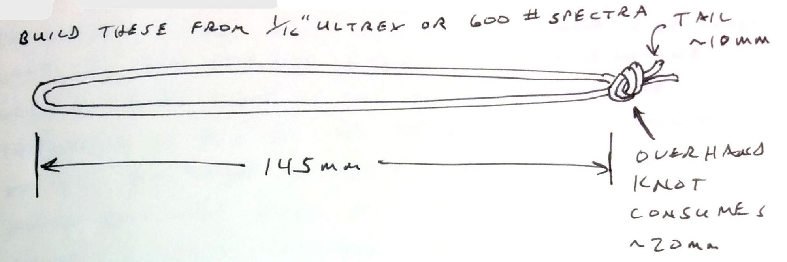{#fig-bar-end-loop fig-alt="Bar end loop" fig-align="center" width="650"}

## Steering Lines

The steering lines run from the bar end loops to the ends of the back lines. They require two 1165mm segments of hollow core braided 1.6mm Dyneema. Mark one end of each segment at 110mm, 190mm, 270mm, and 410mm. Use these marks to create a brummel splice with an 80mm loop. See the loop details in @fig-steering-line-loop-details

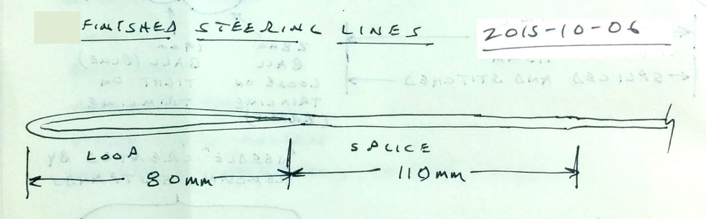{#fig-steering-line-loop-details fig-alt="Steering line loop details" fig-align="center" width="650"}

With the loops complete, stretch the pair of lines evenly and mark both lines at about 50mm from the non-loop end. Tie an overhand knot in each line at the mark. Gently pinch the line with an adjustable wrench on the loop side of the knots. Use the wrench to pull the knots evenly while you pull the ends with standard pliers. With the knot complete and the lines equal in length, tie a second overhand knot close to the first knot to act as a stopper for the first. Then put a little cyanoacrylate glue or a small wrap of insignia cloth on the line ends to prevent fraying.

# Assembly

## Bar assembly and threading line

To thread the trim line, put the threaded end through the cleat, entering at the jam side. Exit the cleat at the top, routing up through the separation block. Reenter the cleat and go through its serpentine path. Leave just enough line above the cleat to provide the desired trim. A spring clamp applied to both sides of the trim line just above the cleat is a good way to maintain the correct amount of trim while threading the trim line. Route the trim line through the cleat bead. The cleat bead is shown in @fig-cleat-bead-view-1 and @fig-cleat-bead-view-2. Go down through the center of the bar. Attach the KQR rings and ring holder with a larks head around the rings, but not the holder. The ring holder holds the rings in the two grooves printed on its concave side.

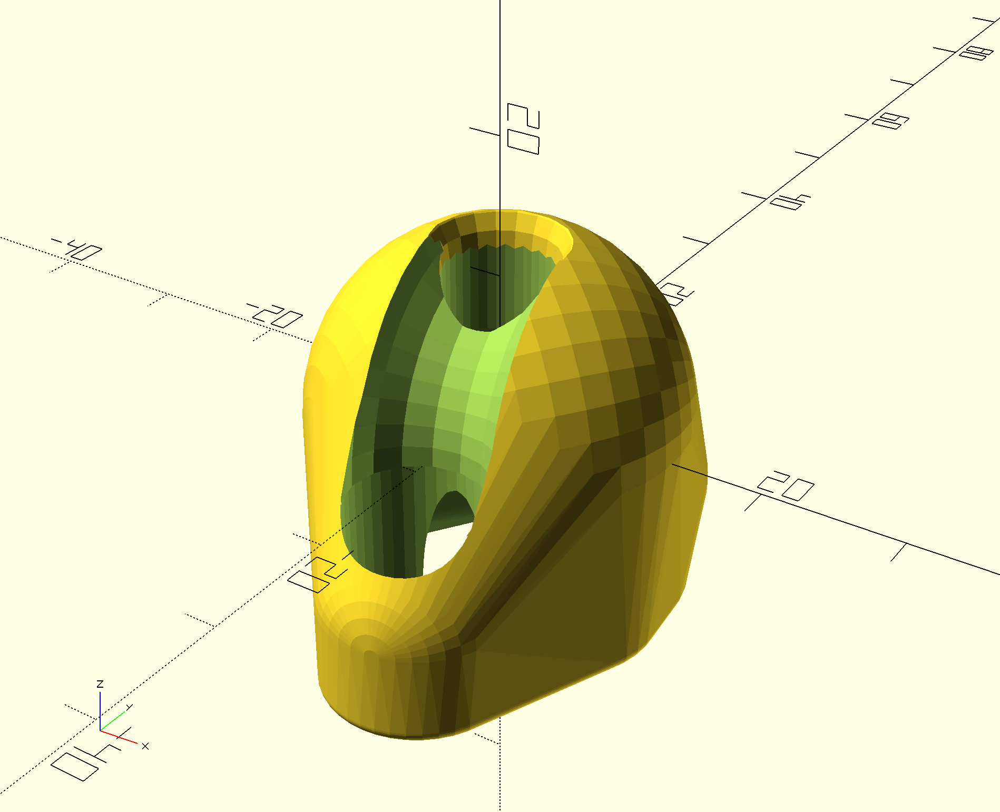{#fig-cleat-bead-view-1 fig-alt="View of the flag line path on the Cleat Bead" fig-align="center" width="350"}

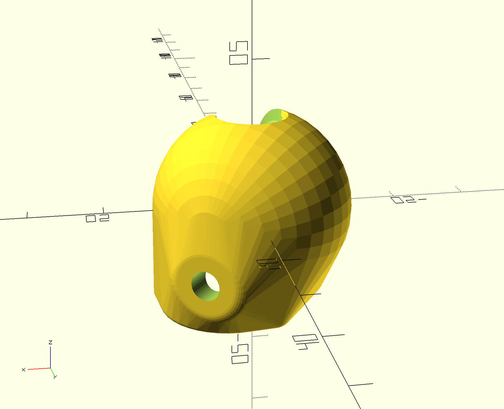{#fig-cleat-bead-view-2 fig-alt="View of the set screw bore hole on the Cleat Bead" fig-align="center" width="350"}

You'll want to verify you can reach the trim line end under normal flying conditions. It's easier to assess the cleat position before the flying lines are attached so pause the assembly for a moment to check and adjust the cleat position. To do this, put your harness on, clip the chickenloop into the harness and have a friend pull on the trim line by the separation block. They should pull the bar to your side about 30 degrees above horizontal. Verify you can reach the jaws of the cleat and grab the trim line tail without over-reaching. If you have to stretch to reach the tail, the cleat is too far away. You can move it closer by moving some of the trim line up through the cleat. For each centimeter you need to move the cleat down, you'll need to move two centimeters of line through the cleat toward the kite. Making this adjustment is a bit tedious, but the trim line tail must be in easy reach under load.

With the cleat position verified, have a friend help you put the trim line in tension. Then slide the cleat bead up to the cleat. Look at the cleat from the pilot's point of view and rotate the cleat until the jaws are up. Check the rotation of the cleat bead so that the flag line guide path is on the lower left side of the cleat. Pull down hard on the trim as you push the bead into the cleat. Maintain this pressure as you use a 3/16" Allen wrench to sink the cleat bead set screw into the trim line. This will lock the bead in place on the base of the Aero Cleat.

## Attaching the main flying lines

With the trim line routed, the flying lines can be attached. Route the right-side flying line down through the separation block and attach the stub line stopper to the end-loop of the flying line with a larks head to retain the flying line in the stopper.

Route the left-side flying line through the remaining hole in the separation block. Continue routing it through the cleat bead, the bar, and the smaller KQR ring. Attach a 3mm x 15mm (ID) ring to the lower end of the flag line. Attach the flag line to the flying line with a larks head. Pull flag line up through the bar and bead with the flying line. The routed lines should look like @fig-flag-line-at-separation-block at the separation block. The over-all assembly should look like @fig-upper-section-of-assembled-bar

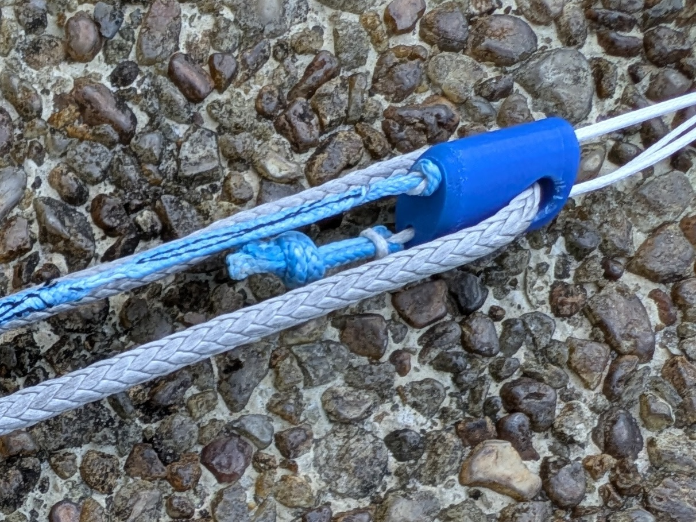{#fig-flag-line-at-separation-block fig-alt="The flag line meets the flying line." fig-align="center" width="650"}

{#fig-upper-section-of-assembled-bar fig-alt="Assembled bar" fig-align="center" width="650"}

## Installing the bar end loops

Pull each bar end loop through one of the holes at the ends of the bar. Route the loop from the pilot-side of the bar to the kite side so the knots are left on the pilot side. Make sure both sides of the loop are even and the knot sits flush against the back of the bar.

## Steering line leaders

Use a larks head to attach the loop of each steering line leader to the loop of its steering line. Then attach the knot of the leader to the loop of the bar-end loop with a larks head. Keeping the knot of the leader line next to the bar minimizes the risk of snagging the steering lines in the components of the bar.

With all the flying lines attached, the trim control let all the way out and the bar pulled all the way back, the tips of all four flying lines should converge to the same point. If they aren't within 50mm of matching, you should adjust the steering lines at the bar to make them a closer match.
